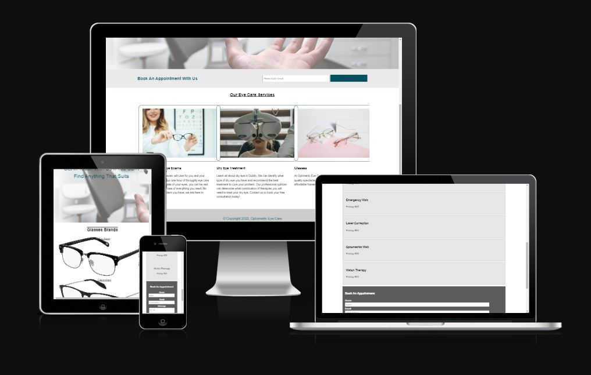
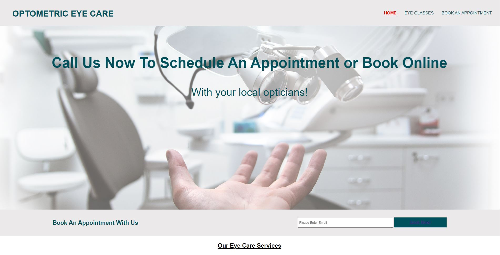

# Optometrist
Optometric Eye Care is a website created for anyone that requires optometrist services ranging from eye exam to purchasing eye glasses. The objective is to provide user easy access to browse options of eye services available to them.

## Feature
In this project, the website is divided into 3 pages. These are homepage, gallery page and book an appointment page. 

This simple navigation shows the user the 3 different pages and with the red highlighted indicating the active page the user is currently on. The homepage of the website display to the user with a welcoming section with eye care service allowing user to understand what the optometrist offer.
 
Below the main heading image, there is a book an appointment button which provide user alternative quick access to reach the appointment page as well as using the navigation bar. 
 
The Eye Glasses page provide user a overall view of different brand of eye wear available.
 
The book an appointment allow user to view different price services and a form below for user to insert their name, email and message to make an appointment.

]

- __Navigation Bar__
 
The navigation bar feature on all 3 pages, each links to their relative page includes Logo, Home page, Eye Glasses and Book An Appointment page. This provide user easy navigation. 

- __The landing page image__
 
The landing page, also the home page includes a image with text overlay to allow user to understand the website service's when they visit.