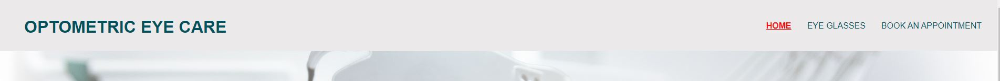
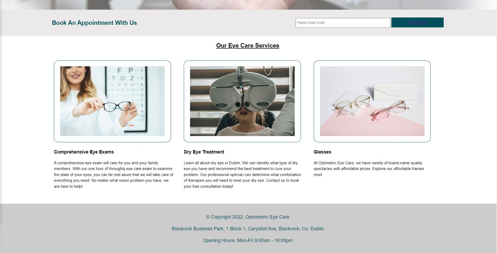

# Optometrist
Optometric Eye Care is a website created for anyone that requires optometrist services ranging from eye exam to purchasing eye glasses. The objective is to provide user easy access to browse options of eye services available to them.

## Feature
In this project, the website is divided into 3 pages. These are homepage, gallery page and book an appointment page. 

This simple navigation shows the user the 3 different pages and with the red highlighted indicating the active page the user is currently on. The homepage of the website display to the user with a welcoming section with eye care service allowing user to understand what the optometrist offer.
 
Below the main heading image, there is a book an appointment button which provide user alternative quick access to reach the appointment page as well as using the navigation bar. 
 
The Eye Glasses page provide user a overall view of different brand of eye wear available.
 
The book an appointment allow user to view different price services and a form below for user to insert their name, email and message to make an appointment.

]

- __Navigation Bar__
 
The navigation bar feature on all 3 pages, each links to their relative page includes Logo, Home page, Eye Glasses and Book An Appointment page. This provide user easy navigation. 

- __The landing page__
 
The landing page, also the home page includes a image with text overlay to allow user to understand the website service's when they visit.

## Services image

 

- __The Services Section__
 
The services section provide user with some information of what service the optometrist eye care is giving the user.

- __The Gallery page/eye glasses__
 
The eye glasses section will allow user to browse through the page to select the available eye wear brand. When the user hover over the brand, there is a selection box which indicate what brand they are at. 

- __The Book An Appointment page__
 
The book appointment page provide user with addition information on the the type of services and they user will be able to make a specific appointment of the service that suits the user. The user will be required to submit their name and email address for making appointment.

- __The Footer Section__
 
The footer section indicate copyright of the website, the address of where the optometrist is located and the opening hours.

### Additional Feature that could possibly be integrated into the project
A date/calander format which allow user to select the date they wish to make appointment easier.

## Testing
The website has been manually tested through different devices and also throught the chrome dev tools. The test result is possitive, however, the navigation bar did not function as intended but it still provide user a easy navigating system.
 
The website has been also tested on Chorme, Firefox, and Microsoft Edge. It is fucntioning as intended. 

### Validator Testing
- HTML
 
There was few minor errors when passing through the official [W3C validator](https://validator.w3.org/nu/?doc=https%3A%2F%2Fjjasont1.github.io%2Foptometrist%2Fappointment.html)
- CSS
 
No errors were found when passing through the the official [(Jigsaw) validator](https://jigsaw.w3.org/css-validator/)

### Unfixed bugs
Some media queries for the Eye Glasses html page is not yet resolved.

## Deployment
- The website is deployed to GitHub pages. The steps to deploy are as follows: 
  - In the GitHub repository, navigate to the Settings tab 
  - Once in the Settings tab, navigate to the Page on the left hand side bar
  - In the subtitle Branch, select main and save. The page will then refresh automatically and provide a dialog indicating the deployment has been successful.

  The live link can be found here - https://jjasont1.github.io/optometrist/index.html

  ## Credits
  - W3Schools [CSS](https://www.w3schools.com/css/)

  - W3Schoold [HTML](https://www.w3schools.com/html/)

  Both these resource were used along with Code Institute resources. 

  ## Media 
  - The photos used on all the pages are from a mix of open source site includes:
  - [Pexels](https://www.pexels.com/)
  - [Unsplash](https://unsplash.com/)
  - [Pixabay](https://pixabay.com/)
